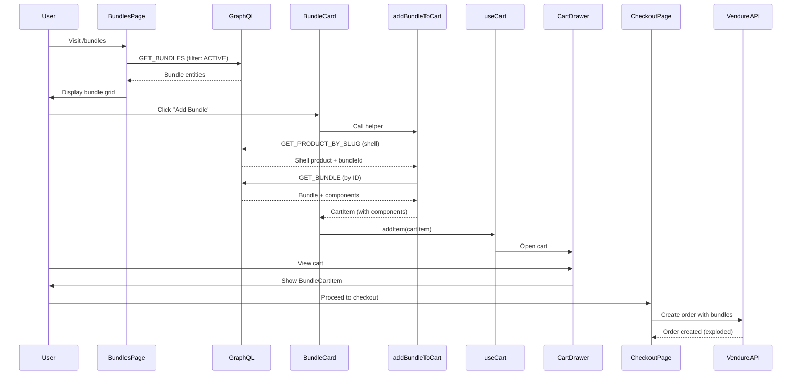

# Bundle System - Complete Storefront Documentation

**Last Updated:** 2025-11-11  
**Framework:** Next.js 14 (App Router) + Apollo Client  
**Status:** Fully Functional

---

## Table of Contents

1. [Overview](#overview)
2. [Pages & Routing](#pages--routing)
3. [GraphQL Integration](#graphql-integration)
4. [Cart System](#cart-system)
5. [Components](#components)
6. [Helpers & Utilities](#helpers--utilities)
7. [Data Flow](#data-flow)
8. [User Journey](#user-journey)
9. [Technical Implementation](#technical-implementation)

---

## Overview

### Architecture

The storefront implements bundle support using:
- **Shell Product Pattern**: Bundles appear as regular products with `customFields.isBundle=true`
- **Unified Cart**: Bundles integrated into existing cart system with special handling
- **GraphQL Queries**: Direct queries to Bundle entities for metadata
- **Client-Side State**: React hooks for cart management

### Technology Stack

- **Framework**: Next.js 14 (App Router, TypeScript)
- **GraphQL Client**: Apollo Client 3.x
- **State Management**: React hooks + context
- **Styling**: Tailwind CSS + CSS custom properties
- **Icons**: Lucide React

### File Structure

```
/apps/web/src/
├── app/
│   ├── bundles/
│   │   └── page.tsx                    # Bundle listing page
│   ├── products/[slug]/
│   │   └── page.tsx                    # Product detail (handles bundles)
│   ├── cart/
│   │   └── page.tsx                    # Cart page (displays bundle items)
│   └── checkout/
│       └── page.tsx                    # Checkout page
├── components/
│   ├── BundleCartItem.tsx              # Bundle-specific cart item UI
│   ├── CartDrawer.tsx                  # Mini cart drawer
│   └── MiniCart.tsx                    # Cart icon with count
├── lib/
│   ├── graphql/
│   │   └── queries.ts                  # GraphQL queries (GET_BUNDLES, GET_BUNDLE)
│   ├── helpers/
│   │   └── bundleCart.ts               # Bundle add-to-cart logic
│   └── hooks/
│       ├── useCart.tsx                 # Cart state management
│       └── useCartWithPlugins.tsx      # Extended cart with backend sync
```

---

## Pages & Routing

### 1. Bundle Listing Page

**Route**: `/bundles`  
**File**: `app/bundles/page.tsx`  
**Purpose**: Display all active bundles in a grid

#### Implementation

```typescript
export default function BundlesPage() {
  const { addItem, openCart } = useCart();
  const apolloClient = useApolloClient();
  
  // Query Bundle entities directly
  const { data, loading, error } = useQuery(GET_BUNDLES, {
    variables: {
      options: {
        filter: { status: { eq: 'ACTIVE' } },
        take: 100
      }
    }
  });
  
  const bundles = data?.bundles?.items || [];
  
  // Filter by date validity
  const visibleBundles = bundles.filter((bundle: any) => {
    if (bundle.status !== 'ACTIVE') return false;
    
    const now = new Date();
    if (bundle.validFrom && now < new Date(bundle.validFrom)) return false;
    if (bundle.validTo && now > new Date(bundle.validTo)) return false;
    
    return true;
  });
  
  // Convert to card format
  const bundleCards = visibleBundles.map((bundle: any) => {
    const componentTotal = bundle.items?.reduce((sum: number, item: any) => 
      sum + (item.unitPrice * 100 * item.quantity), 0
    ) || 0;
    
    const bundlePrice = bundle.effectivePrice;
    const savings = Math.max(0, componentTotal - bundlePrice);
    
    return {
      id: bundle.id,
      name: bundle.name,
      slug: bundle.shellProduct?.slug || bundle.slug,
      image: bundle.featuredAsset?.preview,
      price: bundlePrice,
      originalPrice: componentTotal,
      savings: savings,
      savingsPercentage: componentTotal > 0 ? Math.round((savings / componentTotal) * 100) : 0,
      itemCount: bundle.items?.length || 0,
      inStock: true
    };
  });
  
  // Add to cart handler
  const handleAddToCart = async (slug: string, bundleCard: BundleCard) => {
    const cartItem = await addBundleToCart({
      slug,
      productId: bundleCard.id,
      productName: bundleCard.name,
      image: bundleCard.image,
      quantity: 1,
      apolloClient
    });
    
    addItem(cartItem);
    openCart();
  };
}
```

#### Key Features

1. **Direct Bundle Query**: Queries Bundle entities (not Products) for accurate metadata
2. **Date Filtering**: Client-side filtering by `validFrom` and `validTo`
3. **Savings Calculation**: Computed from component prices vs bundle price
4. **Shell Product Slug**: Uses shell product slug for SEO-friendly URLs
5. **Stock Status**: Bundles are in-stock if ACTIVE and within date range

#### Data Source

- **Primary**: `GET_BUNDLES` query → Bundle entities
- **Slug**: Uses `bundle.shellProduct.slug` for navigation
- **Images**: From `bundle.featuredAsset.preview` or `bundle.assets[0].preview`

---

### 2. Product Detail Page (Bundle Support)

**Route**: `/products/[slug]`  
**File**: `app/products/[slug]/page.tsx`  
**Purpose**: Display product/bundle details, handle add-to-cart

#### Bundle Detection

```typescript
// Fetch product by slug
const { data } = await apolloClient.query({
  query: GET_PRODUCT_BY_SLUG,
  variables: { slug }
});

const product = data?.product;
const isBundle = product?.customFields?.isBundle === true;
const bundleId = product?.customFields?.bundleId;
```

#### Bundle-Specific Rendering

```typescript
if (isBundle && bundleId) {
  // Fetch Bundle entity for component details
  const { data: bundleData } = await apolloClient.query({
    query: GET_BUNDLE,
    variables: { id: bundleId }
  });
  
  const bundle = bundleData?.bundle;
  
  // Display:
  // - Bundle badge
  // - Component list
  // - Savings information
  // - Bundle-specific add-to-cart
}
```

#### Add to Cart Logic

```typescript
const handleAddToCart = async () => {
  if (isBundle) {
    // Use bundle helper
    const cartItem = await addBundleToCart({
      slug: product.slug,
      productId: product.id,
      productName: product.name,
      image: product.featuredAsset?.preview,
      quantity,
      apolloClient
    });
    
    addItem(cartItem);
  } else {
    // Regular product flow
    addItem({
      id: product.id,
      variantId: selectedVariant.id,
      productName: product.name,
      price: selectedVariant.priceWithTax,
      quantity
    });
  }
};
```

#### Component Display

```tsx
{isBundle && bundle && (
  <div className="bundle-components mt-6">
    <h3 className="text-lg font-semibold mb-4">Bundle Contents:</h3>
    <div className="space-y-3">
      {bundle.items
        .sort((a, b) => a.displayOrder - b.displayOrder)
        .map((item) => (
          <div key={item.id} className="flex items-center gap-3 p-3 bg-gray-50 rounded">
            <div className="w-12 h-12 bg-white rounded flex items-center justify-center">
              
            </div>
            <div className="flex-1">
              <div className="font-medium">{item.productVariant?.name}</div>
              <div className="text-sm text-gray-600">Qty: {item.quantity}</div>
            </div>
            <div className="text-right">
              <div className="font-semibold">
                ${(item.unitPrice || 0).toFixed(2)}
              </div>
            </div>
          </div>
        ))
      }
    </div>
    
    {bundle.totalSavings > 0 && (
      <div className="mt-4 p-4 bg-green-50 rounded">
        <div className="text-lg font-bold text-green-600">
          Save ${(bundle.totalSavings / 100).toFixed(2)}
        </div>
        <div className="text-sm text-green-700">
          Compared to buying items separately
        </div>
      </div>
    )}
  </div>
)}
```

---

### 3. Cart Page

**Route**: `/cart`  
**File**: `app/cart/page.tsx`  
**Purpose**: Display cart items, handle quantity updates

#### Bundle Item Rendering

```typescript
{items.map(item => (
  item.isBundle ? (
    <BundleCartItem 
      key={item.variantId}
      item={item}
      onUpdateQuantity={updateQuantity}
      onRemove={removeItem}
    />
  ) : (
    <RegularCartItem 
      key={item.variantId}
      item={item}
      onUpdateQuantity={updateQuantity}
      onRemove={removeItem}
    />
  )
))}
```

---

### 4. Checkout Page

**Route**: `/checkout`  
**File**: `app/checkout/page.tsx`  
**Purpose**: Complete order, process bundle lines

#### Bundle Handling

Bundles appear as regular items in the Vendure order. The backend handles exploding bundles into parent + child lines automatically via mutations like `addBundleToOrder`.

---

## GraphQL Integration

### Queries

#### GET_BUNDLES

**File**: `lib/graphql/queries.ts`  
**Purpose**: Fetch all bundles with full details

```graphql
query GetBundles($options: BundleListOptions) {
  bundles(options: $options) {
    items {
      id
      name
      slug
      description
      status
      discountType
      fixedPrice
      percentOff
      version
      validFrom
      validTo
      bundleCap
      bundleReservedOpen
      bundleVirtualStock
      featuredAsset {
        id
        preview
      }
      assets {
        id
        preview
      }
      shellProduct {
        id
        slug
        name
      }
      items {
        id
        quantity
        unitPrice
        displayOrder
        productVariant {
          id
          name
          sku
          price
          priceWithTax
          featuredAsset {
            preview
          }
        }
      }
      effectivePrice
      totalSavings
      isAvailable
    }
    totalItems
  }
}
```

**Usage**:
```typescript
const { data } = useQuery(GET_BUNDLES, {
  variables: {
    options: {
      filter: { status: { eq: 'ACTIVE' } },
      take: 100
    }
  }
});
```

---

#### GET_BUNDLE

**Purpose**: Fetch single bundle by ID

```graphql
query GetBundle($id: ID!) {
  bundle(id: $id) {
    id
    name
    description
    effectivePrice
    totalSavings
    items {
      id
      quantity
      unitPrice
      displayOrder
      productVariant {
        id
        name
        sku
        priceWithTax
        featuredAsset {
          preview
        }
      }
    }
  }
}
```

**Usage**:
```typescript
const { data } = await apolloClient.query({
  query: GET_BUNDLE,
  variables: { id: bundleId }
});
```

---

#### GET_PRODUCT_BY_SLUG

**Purpose**: Fetch product (including shell products) by slug

```graphql
query GetProductBySlug($slug: String!) {
  product(slug: $slug) {
    id
    name
    slug
    description
    featuredAsset {
      preview
    }
    customFields {
      isBundle
      bundleId
      bundlePrice
      bundleAvailability
    }
    variants {
      id
      name
      price
      priceWithTax
      stockLevel
    }
  }
}
```

**Bundle Detection**:
```typescript
const isBundle = product?.customFields?.isBundle === true;
const bundleId = product?.customFields?.bundleId;
```

---

## Cart System

### Cart Item Structure

```typescript
interface CartItem {
  id: string;                    // Product ID
  variantId: string;             // ProductVariant ID (shell variant for bundles)
  productName: string;           // Display name
  price: number;                 // Price WITH tax in cents
  originalPrice?: number;        // Component total (for bundles)
  quantity: number;              // Quantity in cart
  image?: string;                // Product image URL
  slug: string;                  // Product slug for links
  inStock: boolean;              // Availability
  
  // Bundle-specific fields
  isBundle?: boolean;            // True if this is a bundle
  bundleId?: string;             // Bundle entity ID
  bundleComponents?: BundleComponent[]; // Component list
}

interface BundleComponent {
  id: string;
  quantity: number;
  unitPrice: number;             // In dollars
  displayOrder: number;
  name?: string;
  productVariant?: {
    id: string;
    name: string;
    sku: string;
    price: number;
    priceWithTax: number;
  };
}
```

### addBundleToCart Helper

**File**: `lib/helpers/bundleCart.ts`  
**Purpose**: Unified bundle add-to-cart logic

```typescript
export async function addBundleToCart(params: AddBundleToCartParams) {
  const { slug, productId, productName, image, quantity = 1, apolloClient } = params;
  
  // 1. Fetch shell product to get bundleId
  const { data: productData } = await apolloClient.query({
    query: GET_PRODUCT_BY_SLUG,
    variables: { slug }
  });
  
  const product = productData?.product;
  const bundleId = product?.customFields?.bundleId;
  const shellVariant = product?.variants?.[0];
  const shellVariantId = shellVariant?.id || productId;
  const priceWithTax = shellVariant?.priceWithTax || 0;
  
  if (!bundleId) {
    throw new Error('Bundle ID not found');
  }
  
  // 2. Fetch Bundle entity for component details
  const { data: bundleData } = await apolloClient.query({
    query: GET_BUNDLE,
    variables: { id: bundleId }
  });
  
  const bundle = bundleData?.bundle;
  
  if (!bundle) {
    throw new Error('Bundle not found');
  }
  
  // 3. Calculate component total for savings
  const componentTotal = bundle.items.reduce(
    (sum: number, item: any) => sum + (item.productVariant?.priceWithTax || 0) * item.quantity,
    0
  );
  
  // 4. Return standardized cart item
  return {
    id: productId,
    variantId: shellVariantId,        // CRITICAL: Shell variant ID
    productName: productName,
    price: priceWithTax,              // CRITICAL: Price WITH tax
    originalPrice: componentTotal,
    image: image || '/product-placeholder.svg',
    slug: slug,
    inStock: (product?.customFields?.bundleAvailability || 0) > 0,
    quantity: quantity,
    isBundle: true,
    bundleId: bundleId,
    bundleComponents: bundle.items
  };
}
```

#### Critical Implementation Details

1. **Shell Variant ID**: Uses shell product's first variant ID (not bundle ID)
2. **Price WITH Tax**: Uses `priceWithTax` from shell variant (Vendure handles tax)
3. **Component Total**: Calculated from component `priceWithTax` for accurate savings
4. **Availability**: From shell product's `customFields.bundleAvailability`
5. **Bundle Components**: Full component list for display

---

### Cart Hook

**File**: `lib/hooks/useCart.tsx`

```typescript
export function useCart() {
  const [items, setItems] = useState<CartItem[]>([]);
  const [isOpen, setIsOpen] = useState(false);
  
  const addItem = (item: CartItem) => {
    setItems(prev => {
      const existing = prev.find(i => i.variantId === item.variantId);
      if (existing) {
        return prev.map(i => 
          i.variantId === item.variantId 
            ? { ...i, quantity: i.quantity + item.quantity }
            : i
        );
      }
      return [...prev, item];
    });
  };
  
  const updateQuantity = (variantId: string, quantity: number) => {
    if (quantity <= 0) {
      removeItem(variantId);
      return;
    }
    
    setItems(prev => prev.map(item =>
      item.variantId === variantId
        ? { ...item, quantity }
        : item
    ));
  };
  
  const removeItem = (variantId: string) => {
    setItems(prev => prev.filter(item => item.variantId !== variantId));
  };
  
  const openCart = () => setIsOpen(true);
  const closeCart = () => setIsOpen(false);
  
  // Totals
  const subtotal = items.reduce((sum, item) => sum + (item.price * item.quantity), 0);
  const totalItems = items.reduce((sum, item) => sum + item.quantity, 0);
  const totalSavings = items.reduce((sum, item) => {
    if (item.isBundle && item.originalPrice) {
      return sum + ((item.originalPrice - item.price) * item.quantity);
    }
    return sum;
  }, 0);
  
  return {
    items,
    subtotal,
    totalItems,
    totalSavings,
    isOpen,
    addItem,
    updateQuantity,
    removeItem,
    openCart,
    closeCart
  };
}
```

---

## Components

### BundleCartItem

**File**: `components/BundleCartItem.tsx`  
**Purpose**: Display bundle in cart with expandable components

#### Features

1. **Bundle Badge**: Visual indicator with Package icon
2. **Savings Display**: Shows total savings in green
3. **Expandable Components**: Click to show/hide bundle contents
4. **Quantity Controls**: +/- buttons (optional)
5. **Component List**: Sorted by displayOrder, shows qty and price
6. **Remove Button**: Delete bundle from cart

#### Implementation

```typescript
export default function BundleCartItem({ 
  item, 
  onUpdateQuantity, 
  onRemove,
  showQuantityControls = true,
  compact = false 
}: BundleCartItemProps) {
  const [isExpanded, setIsExpanded] = useState(false);
  
  if (!item.isBundle || !item.bundleComponents) {
    return null;
  }
  
  const savings = item.originalPrice && item.price < item.originalPrice 
    ? item.originalPrice - item.price 
    : 0;
  
  return (
    <div className="space-y-3">
      {/* Bundle Header */}
      <div className="flex gap-4">
        {/* Image with Badge */}
        <div className="w-20 h-20 relative">
          
          <div className="absolute top-1 left-1 bg-primary text-white px-1 rounded">
            <Package className="w-2 h-2" />
          </div>
        </div>
        
        {/* Bundle Info */}
        <div className="flex-1">
          <h3 className="font-semibold flex items-center gap-2">
            {item.productName}
            <button onClick={() => setIsExpanded(!isExpanded)}>
              {isExpanded ? <ChevronUp /> : <ChevronDown />}
            </button>
          </h3>
          
          <p className="text-gray-600 text-sm">
            {item.bundleComponents.length} items included
          </p>
          
          {savings > 0 && (
            <div className="text-success font-semibold">
              Save ${(savings / 100).toFixed(2)}
            </div>
          )}
          
          {showQuantityControls && (
            <div className="flex items-center gap-2 mt-2">
              <button onClick={() => onUpdateQuantity(item.variantId, item.quantity - 1)}>
                <Minus className="w-3 h-3" />
              </button>
              <span>{item.quantity}</span>
              <button onClick={() => onUpdateQuantity(item.variantId, item.quantity + 1)}>
                <Plus className="w-3 h-3" />
              </button>
            </div>
          )}
        </div>
        
        {/* Price */}
        <div className="text-right">
          <div className="font-bold text-lg">
            ${(item.price / 100).toFixed(2)}
          </div>
          {savings > 0 && (
            <div className="line-through text-gray-400 text-sm">
              ${(item.originalPrice! / 100).toFixed(2)}
            </div>
          )}
          <button onClick={() => onRemove(item.variantId)} className="text-red-500 text-sm">
            <Trash2 className="w-3 h-3" />
            Remove
          </button>
        </div>
      </div>
      
      {/* Expandable Components */}
      {isExpanded && (
        <div className="ml-6 pl-4 border-l-2 space-y-2">
          <h4 className="text-sm font-medium">Bundle Contents:</h4>
          {[...item.bundleComponents]
            .sort((a, b) => (a.displayOrder || 0) - (b.displayOrder || 0))
            .map((component) => (
              <div key={component.id} className="flex items-center gap-3 py-2 text-sm">
                <div className="w-8 h-8 bg-gray-100 rounded">
                  
                </div>
                <div className="flex-1">
                  <div className="font-medium">
                    {component.productVariant?.name || component.name}
                  </div>
                  <div className="text-gray-600 text-xs">
                    SKU: {component.productVariant?.sku || 'N/A'}
                  </div>
                </div>
                <div className="text-right">
                  <div className="font-medium">
                    ${(component.unitPrice || 0).toFixed(2)}
                  </div>
                  <div className="text-xs text-gray-600">
                    Qty: {component.quantity}
                  </div>
                </div>
              </div>
            ))
          }
        </div>
      )}
    </div>
  );
}
```

---

## Data Flow

### Bundle Discovery → Cart → Checkout



---

## User Journey

### 1. Browse Bundles

**User Action**: Navigate to `/bundles`

**System Behavior**:
1. Query `GET_BUNDLES` with filter `status: ACTIVE`
2. Filter bundles by `validFrom` and `validTo` (client-side)
3. Calculate savings for each bundle
4. Display in grid with:
   - Bundle name and image
   - Price and savings percentage
   - "X items included" text
   - "ADD BUNDLE" button

**Visual Elements**:
- Bundle badge (top-left)
- Savings badge (top-right, red)
- Star rating (placeholder)
- Price with savings

---

### 2. View Bundle Details

**User Action**: Click bundle card → Navigate to `/products/{shell-product-slug}`

**System Behavior**:
1. Fetch product by slug
2. Detect `customFields.isBundle === true`
3. Fetch Bundle entity by `customFields.bundleId`
4. Display:
   - Bundle name and description
   - Component list (sorted by displayOrder)
   - Each component: image, name, qty, price
   - Total savings callout
   - "Add to Cart" button

---

### 3. Add Bundle to Cart

**User Action**: Click "Add to Cart" or "ADD BUNDLE" button

**System Behavior**:
1. Call `addBundleToCart()` helper
2. Fetch shell product and Bundle entity
3. Create CartItem with:
   - Shell variant ID
   - Price WITH tax
   - Bundle components
4. Add to cart state
5. Open CartDrawer

**Cart Display**:
- BundleCartItem component
- Expandable components list
- Savings amount highlighted

---

### 4. Modify Cart

**User Actions**:
- Expand/collapse components
- Change quantity (+/-)
- Remove bundle

**System Behavior**:
- Quantity changes: Update cart state
- Remove: Filter out by variantId
- Recalculate totals (subtotal, savings)

---

### 5. Checkout

**User Action**: Click "Checkout" button

**System Behavior**:
1. Navigate to `/checkout`
2. Display all cart items (including bundles)
3. Show totals with savings
4. On submit:
   - Backend `addBundleToOrder` mutation
   - Creates parent + child lines (exploded pattern)
   - Vendure handles stock allocation and tax

---

## Technical Implementation

### Price Handling

**CRITICAL**: All prices use **WITH TAX** values in storefront.

```typescript
// Shell variant (fetched in addBundleToCart)
const priceWithTax = shellVariant?.priceWithTax || 0; // In cents

// Component total (for savings calculation)
const componentTotal = bundle.items.reduce(
  (sum, item) => sum + (item.productVariant?.priceWithTax || 0) * item.quantity,
  0
);

// Cart item
cartItem.price = priceWithTax; // WITH tax
cartItem.originalPrice = componentTotal; // WITH tax
```

**Why WITH TAX?**
- Consistent with customer expectations (final price)
- Matches checkout total
- Simplifies calculations
- Vendure backend already computed tax

---

### Component Sorting

**Always sort by displayOrder**:

```typescript
bundle.items
  .sort((a, b) => (a.displayOrder || 0) - (b.displayOrder || 0))
  .map(item => ...)
```

---

### Error Handling

```typescript
try {
  const cartItem = await addBundleToCart({...});
  addItem(cartItem);
  openCart();
} catch (err) {
  console.error('Error adding bundle to cart:', err);
  // Show error toast/message
  toast.error('Failed to add bundle to cart');
}
```

---

### Availability Display

```typescript
// From shell product's synced availability
const inStock = (product?.customFields?.bundleAvailability || 0) > 0;

// Visual indicator
{!inStock && (
  <div className="absolute inset-0 bg-black/50 flex items-center justify-center">
    <span className="bg-white px-4 py-2 font-bold">
      OUT OF STOCK
    </span>
  </div>
)}
```

---

### Bundle Badge

```tsx
<div className="absolute top-2 left-2 bg-primary text-white px-2 py-1 rounded text-xs flex items-center gap-1">
  <Package className="w-3 h-3" />
  Bundle
</div>
```

---

### Savings Display

```tsx
{savings > 0 && (
  <div className="text-green-600 font-semibold text-base">
    Save ${(savings / 100).toFixed(2)}
  </div>
)}
```

---

## Current Implementation Status

### ✅ Fully Functional

1. **Bundle Listing**: `/bundles` page displays all active bundles
2. **Bundle Details**: Product detail page detects and displays bundle info
3. **Add to Cart**: `addBundleToCart` helper creates proper cart items
4. **Cart Display**: `BundleCartItem` component shows bundles with components
5. **Checkout**: Bundles flow through checkout to Vendure backend

### 🔄 In Progress

- Availability indicator (using `bundleAvailability` from shell product)
- Bundle virtual stock display (Phase 4 - not yet implemented)

### 📋 Not Implemented

- Bundle recommendations on cart page
- Bundle opportunity detection
- Related bundles on PDP
- Bundle reviews/ratings (placeholders only)

---

## Testing Recommendations

### Manual Testing Checklist

1. **Browse Bundles**:
   - [ ] Navigate to `/bundles`
   - [ ] Verify ACTIVE bundles display
   - [ ] Check date filtering (validFrom/validTo)
   - [ ] Verify savings calculations
   - [ ] Click bundle card → navigates to PDP

2. **Bundle PDP**:
   - [ ] Shell product URL works
   - [ ] Bundle badge displays
   - [ ] Components list shows correctly
   - [ ] Components sorted by displayOrder
   - [ ] Savings amount accurate
   - [ ] "Add to Cart" works

3. **Cart**:
   - [ ] Bundle appears in cart
   - [ ] Expand/collapse components works
   - [ ] Savings displayed correctly
   - [ ] Quantity controls work
   - [ ] Remove bundle works
   - [ ] Totals calculate correctly

4. **Checkout**:
   - [ ] Bundles appear in order summary
   - [ ] Final totals match cart
   - [ ] Order placement succeeds
   - [ ] Backend creates exploded lines

---

## Troubleshooting

### Issue: Bundle not displaying in `/bundles`

**Check**:
1. Bundle status is ACTIVE
2. Bundle within `validFrom`/`validTo` dates
3. Bundle has shell product with slug
4. GraphQL query returns data

**Fix**: Check bundle in admin GraphQL:
```graphql
query {
  bundle(id: "X") {
    status
    validFrom
    validTo
    shellProduct {
      slug
    }
  }
}
```

---

### Issue: "Bundle ID not found" error

**Cause**: Shell product missing `customFields.bundleId`

**Fix**: Re-sync bundle to shell product via admin API

---

### Issue: Savings calculation incorrect

**Cause**: Using PRE-TAX prices instead of WITH-TAX

**Fix**: Ensure `priceWithTax` used for all calculations:
```typescript
// CORRECT
const componentTotal = bundle.items.reduce(
  (sum, item) => sum + (item.productVariant?.priceWithTax || 0) * item.quantity,
  0
);

// WRONG
const componentTotal = bundle.items.reduce(
  (sum, item) => sum + (item.productVariant?.price || 0) * item.quantity,
  0
);
```

---

### Issue: Components not sorted correctly

**Cause**: Not sorting by displayOrder

**Fix**:
```typescript
bundle.items
  .sort((a, b) => (a.displayOrder || 0) - (b.displayOrder || 0))
  .map(...)
```

---

## Performance Considerations

1. **GraphQL Caching**: Apollo Client caches queries automatically
2. **Image Loading**: Use lazy loading for bundle images
3. **Component Expansion**: Default to collapsed for performance
4. **Cart State**: Persist to localStorage for session restoration

---

## Future Enhancements

1. **Virtual Stock Display**: Show bundle capacity on PDP
2. **Reservation Countdown**: "Only X left at this price!"
3. **Bundle Recommendations**: "You may also like..."
4. **Quick Add**: Add bundle directly from listing page
5. **Bundle Comparison**: Compare multiple bundles side-by-side
6. **Savings Calculator**: Interactive savings visualization

---

**End of Documentation**

*This documentation reflects the actual implemented code as of 2025-11-11. All code references are to committed files in the repository.*
